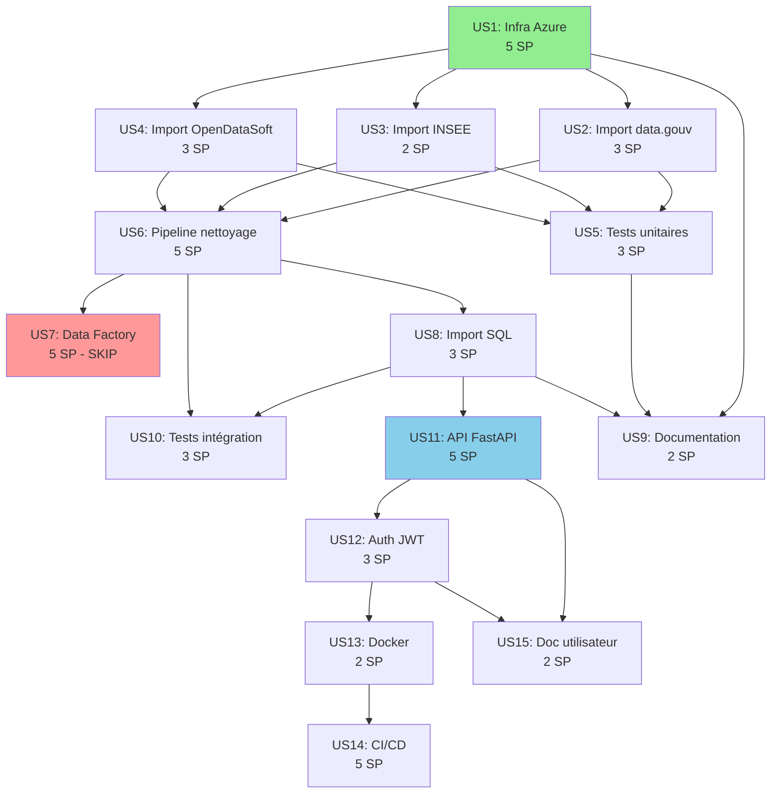

# PARTIE 3 : PLANIFICATION ET ESTIMATION
## Projet Education Data Hub - Organisation et Méthodes

---

## 3.1 COMPOSITION DE L'ÉQUIPE PROJET

### 3.1.1 Organigramme de l'Équipe

```
                    ┌─────────────────────────┐
                    │   PRODUCT OWNER         │
                    │  (Encadrant formation)  │
                    │  - Valide les US        │
                    │  - Priorise le backlog  │
                    └───────────┬─────────────┘
                                │
                    ┌───────────▼─────────────┐
                    │   SCRUM MASTER          │
                    │   (Data Engineer)       │
                    │  - Anime les rituels    │
                    │  - Supprime obstacles   │
                    └───────────┬─────────────┘
                                │
        ┌───────────────────────┼───────────────────────┐
        │                       │                       │
┌───────▼────────┐    ┌────────▼────────┐    ┌────────▼────────┐
│ DATA ENGINEER  │    │  TESTEUR/QA     │    │  STAKEHOLDERS   │
│     (Vous)     │    │ (Peer Review)   │    │   (Externes)    │
│ - Développe    │    │ - Code review   │    │ - Utilisateurs  │
│ - Teste        │    │ - Validation    │    │ - Chercheurs    │
│ - Déploie      │    │   fonctionnelle │    │ - Établissements│
│ - Documente    │    └─────────────────┘    └─────────────────┘
└────────────────┘
```

### 3.1.2 Matrice des Responsabilités (RACI)

| Activité | Data Engineer | Product Owner | Testeur | Stakeholders |
|----------|---------------|---------------|---------|--------------|
| **Sprint Planning** | R, A | C, I | I | I |
| **Développement code** | R, A | - | - | - |
| **Tests unitaires** | R, A | - | C | - |
| **Code review** | C | - | R, A | - |
| **Sprint Review** | R, I | A, C | I | C |
| **Sprint Retro** | R, A | C | C | - |
| **Validation US** | I | R, A | C | - |
| **Déploiement** | R, A | I | C | - |
| **Documentation** | R, A | C | - | I |
| **Priorisation backlog** | C | R, A | - | I |

**Légende** :
- **R** (Responsible) : Réalise l'activité
- **A** (Accountable) : Responsable final/décideur
- **C** (Consulted) : Consulté pour avis
- **I** (Informed) : Informé des résultats

### 3.1.3 Profils et Compétences de l'Équipe

#### **Data Engineer (Vous) - Temps plein (35h/semaine)**

**Compétences techniques** :
- ✅ Python (pandas, FastAPI, pytest) - Expert
- ✅ SQL (requêtes, modélisation) - Avancé
- ✅ Cloud Azure (Storage, SQL Database, Container Instance) - Intermédiaire
- ✅ Terraform (Infrastructure as Code) - Intermédiaire
- ✅ Git/GitHub (versioning, CI/CD) - Avancé
- ✅ Docker (conteneurisation) - Intermédiaire
- ✅ Méthodologie Agile/Scrum - Avancé

**Responsabilités** :
- Développement complet du MVP (infrastructure → API)
- Écriture et maintenance des tests (unitaires, intégration)
- Configuration CI/CD (GitHub Actions)
- Déploiement sur Azure
- Documentation technique et utilisateur
- Animation des rituels Agile (Scrum Master)

**Disponibilité** :
- 7h/jour pendant 6 semaines
- Disponible pour Sprint Reviews/Retros (hors heures si nécessaire)

---

#### **Product Owner (Encadrant) - 2h/sprint**

**Rôle** :
- Validation des objectifs et périmètre
- Priorisation du Product Backlog
- Acceptation des User Stories (Sprint Review)
- Arbitrage en cas de conflit/changement

**Disponibilité** :
- Sprint Planning : 2h toutes les 2 semaines
- Sprint Review : 1h toutes les 2 semaines
- Communication asynchrone (email, GitHub Issues) : réponse <24h

---

#### **Testeur/QA (Peer Review) - 2h/sprint**

**Rôle** :
- Revue de code (Pull Requests GitHub)
- Validation fonctionnelle des livrables
- Tests exploratoires (points bloquants)

**Disponibilité** :
- Code review : 30 min par Pull Request majeure
- Tests fonctionnels : 1h par sprint

---

### 3.1.4 Justification de la Composition

**Pourquoi cette composition minimale ?**

✅ **Contexte certification individuelle** : Le projet est réalisé dans le cadre d'une certification Data Engineer, où le candidat doit démontrer sa capacité à gérer un projet de bout en bout.

✅ **Compétences suffisantes** : Le Data Engineer possède toutes les compétences techniques nécessaires (stack Python/Azure/SQL maîtrisée).

✅ **Product Owner externe** : Permet d'avoir un regard critique et une validation des livrables par un tiers (encadrant = proxy du client).

✅ **Peer review léger** : Garantit la qualité du code sans surcharger l'équipe (revue asynchrone via GitHub).

⚠️ **Risque identifié** : Perte de compétence clé (Data Engineer unique)
→ **Mitigation** : Documentation exhaustive, code versioned sur GitHub, communication régulière avec le PO.

---

## 3.2 CALENDRIER DÉTAILLÉ AVEC PLANNING POKER

### 3.2.1 Méthode d'Estimation : Planning Poker

**Principe** : Estimation collective et itérative de la complexité des User Stories.

**Échelle utilisée** : Suite de Fibonacci modifiée
- **1 SP** : Très simple (< 2h)
- **2 SP** : Simple (2-4h)
- **3 SP** : Moyen (4-8h = 1 jour)
- **5 SP** : Complexe (8-16h = 2 jours)
- **8 SP** : Très complexe (> 16h = 3 jours)

**Facteurs pris en compte dans l'estimation** :
1. **Complexité technique** : Nombre de technologies impliquées
2. **Incertitude** : Clarté des spécifications
3. **Effort** : Temps de développement + tests + documentation
4. **Dépendances** : Nombre d'interactions avec d'autres composants

### 3.2.2 Tableau Détaillé des Estimations (Planning Poker)

| ID | User Story | Complexité | Incertitude | Effort | SP | Jours | Justification |
|----|------------|------------|-------------|--------|----|----|---------------|
| **US1** | Infrastructure Terraform | Élevée | Moyenne | Élevé | **5** | 2.5 | Multiples ressources Azure, configuration réseau, state distant |
| **US2** | Import data.gouv | Moyenne | Faible | Moyen | **3** | 1.5 | 4 fichiers, conversion UTF-8, gestion erreurs |
| **US3** | Import INSEE | Faible | Faible | Faible | **2** | 1.0 | 1 fichier Excel, réutilisation module `azure_upload` |
| **US4** | Import OpenDataSoft | Moyenne | Moyenne | Moyen | **3** | 1.5 | API REST, pagination (9 requêtes), agrégation JSON |
| **US5** | Tests unitaires imports | Moyenne | Faible | Moyen | **3** | 1.5 | Fixtures, mocking, couverture >80%, CI/CD |
| **US6** | Pipeline nettoyage | Élevée | Moyenne | Élevé | **5** | 2.5 | Pandas, normalisation complexe, workflow GitHub Actions |
| **US7** | Data Factory Parquet | Élevée | Élevée | Élevé | **5** | 2.5 | Configuration ADF, datasets, pipeline, trigger (optionnel) |
| **US8** | Import SQL | Moyenne | Moyenne | Moyen | **3** | 1.5 | Création tables dynamique, ODBC, 4 scripts parallèles |
| **US9** | Documentation technique | Faible | Faible | Faible | **2** | 1.0 | README, diagrammes Mermaid, docstrings |
| **US10** | Tests intégration | Moyenne | Moyenne | Moyen | **3** | 1.5 | Tests end-to-end, fixtures environnement, CI/CD |
| **US11** | API FastAPI | Élevée | Faible | Élevé | **5** | 2.5 | Endpoints, connexion SQL, CORS, OpenAPI, gestion erreurs |
| **US12** | Authentification JWT | Moyenne | Moyenne | Moyen | **3** | 1.5 | Table users, bcrypt, JWT, middleware, tests |
| **US13** | Dockerisation API | Faible | Faible | Moyen | **2** | 1.0 | Dockerfile, ODBC Driver install, .dockerignore |
| **US14** | CI/CD GitHub Actions | Élevée | Moyenne | Élevé | **5** | 2.5 | 2 workflows (CI + Docker), OIDC Azure, déploiement ACI |
| **US15** | Documentation utilisateur | Faible | Faible | Faible | **2** | 1.0 | README API, exemples curl/Python, guide authentification |

**Total** : **51 Story Points** ≈ **25.5 jours de développement**

**Ajustement avec buffer 20%** : 25.5j × 1.2 = **30.6 jours** (~6 semaines calendaires avec week-ends)

### 3.2.3 Conversion Story Points → Jours

**Formule retenue** : **1 Story Point = 0.5 jour de développement effectif**

**Rationale** :
- Développement : 60% du temps (codage, debug)
- Tests : 20% du temps (unitaires, intégration)
- Documentation : 10% du temps (README, docstrings)
- Réunions/Rituels : 10% du temps (Sprint Planning, Reviews, Retros)

**Exemple US1 (5 SP)** :
- Développement : 1.5j (Terraform, configuration Azure)
- Tests : 0.5j (terraform plan, validation manuelle)
- Documentation : 0.25j (README Terraform)
- Rituels : 0.25j (Sprint Planning, présentation démo)
- **Total : 2.5 jours**

---

## 3.3 CALENDRIER DE PRODUCTION DÉTAILLÉ

### 3.3.1 Vue Globale - Diagramme de Gantt (6 semaines)

```mermaid
gantt
    title Calendrier Production Education Data Hub (42 jours ouvrés)
    dateFormat YYYY-MM-DD
    
    section Préparation
    Kick-off & Sprint Planning 1   :milestone, m1, 2024-01-08, 0d
    
    section Sprint 1 (10j)
    US1: Infrastructure             :s1-us1, 2024-01-08, 2.5d
    US2: Import data.gouv           :s1-us2, after s1-us1, 1.5d
    US3: Import INSEE               :s1-us3, after s1-us1, 1d
    US4: Import OpenDataSoft        :s1-us4, after s1-us1, 1.5d
    US5: Tests unitaires            :s1-us5, after s1-us2 s1-us3 s1-us4, 1.5d
    Sprint Review 1                 :milestone, m2, 2024-01-19, 0d
    Sprint Retro 1                  :crit, 2024-01-19, 0.5d
    
    section Sprint 2 (10j)
    Sprint Planning 2               :crit, 2024-01-22, 0.5d
    US6: Pipeline nettoyage         :s2-us6, 2024-01-22, 2.5d
    US7: Data Factory (SKIP)        :done, s2-us7, after s2-us6, 0d
    US8: Import SQL                 :s2-us8, after s2-us6, 1.5d
    US9: Documentation tech         :s2-us9, after s2-us8, 1d
    US10: Tests intégration         :s2-us10, after s2-us8, 1.5d
    Sprint Review 2                 :milestone, m3, 2024-02-02, 0d
    Sprint Retro 2                  :crit, 2024-02-02, 0.5d
    
    section Sprint 3 (10j)
    Sprint Planning 3               :crit, 2024-02-05, 0.5d
    US11: API FastAPI               :s3-us11, 2024-02-05, 2.5d
    US12: Auth JWT                  :s3-us12, after s3-us11, 1.5d
    US13: Docker                    :s3-us13, after s3-us12, 1d
    US14: CI/CD                     :s3-us14, after s3-us13, 2.5d
    US15: Doc utilisateur           :s3-us15, after s3-us14, 1d
    Sprint Review 3                 :milestone, m4, 2024-02-16, 0d
    Sprint Retro 3                  :crit, 2024-02-16, 0.5d
    
    section Recette & Go Live
    Tests acceptance utilisateurs   :2024-02-19, 2d
    Corrections mineures            :2024-02-19, 1d
    Formation utilisateurs          :2024-02-20, 1d
    Go Live                         :milestone, m5, 2024-02-21, 0d
```

### 3.3.2 Calendrier Détaillé par Sprint

#### **SPRINT 1 : Infrastructure & Import (08/01 - 19/01)**

| Semaine | Jour | Date | Tâches | Temps | Livrables |
|---------|------|------|--------|-------|-----------|
| **S1** | Lun | 08/01 | **Kick-off + Sprint Planning 1**<br>- Présentation projet<br>- Validation backlog<br>- Décomposition US1-US5<br>**US1 (début)** : Setup Terraform files | 2h + 5h | - Backlog priorisé<br>- Sprint Goal défini<br>- Fichiers Terraform créés |
| S1 | Mar | 09/01 | **US1** : Provision Resource Group + Storage Account | 7h | - RG créé<br>- Data Lake Gen2 configuré |
| S1 | Mer | 10/01 | **US1** : Provision SQL Server + Backend Terraform | 7h | - SQL Server/DB créés<br>- Backend distant configuré |
| S1 | Jeu | 11/01 | **US2** : Develop `azure_upload.py` + `import_data_gouv.py` | 7h | - Module upload fonctionnel<br>- Script import data.gouv |
| S1 | Ven | 12/01 | **US2** : Workflow GitHub Actions + Tests<br>**US3** : `import_insee.py` | 3.5h + 3.5h | - Workflow import data.gouv<br>- Script INSEE terminé |
| **S2** | Lun | 15/01 | **US3** : Workflow INSEE + Tests<br>**US4 (début)** : `import_opendatasoft.py` | 3.5h + 3.5h | - Workflow INSEE<br>- API OpenDataSoft interrogée |
| S2 | Mar | 16/01 | **US4** : Agrégation JSON + Upload + Workflow | 7h | - Fichier JSON combiné<br>- Workflow OpenDataSoft |
| S2 | Mer | 17/01 | **US5** : Setup tests structure + Tests unitaires imports | 7h | - Structure `tests/` créée<br>- Tests azure_upload.py |
| S2 | Jeu | 18/01 | **US5** : Tests imports + Workflow CI + Couverture | 7h | - Tests complets<br>- CI/CD configuré<br>- Couverture 85% |
| S2 | Ven | 19/01 | **Sprint Review 1** : Démo<br>**Sprint Retro 1** | 1h + 1h | - Démo imports automatisés<br>- Actions d'amélioration |

**Vélocité Sprint 1** : 16 SP / 10 jours = **1.6 SP/jour**

---

#### **SPRINT 2 : Pipeline & SQL (22/01 - 02/02)**

| Semaine | Jour | Date | Tâches | Temps | Livrables |
|---------|------|------|--------|-------|-----------|
| **S3** | Lun | 22/01 | **Sprint Planning 2**<br>**US6 (début)** : `move_and_clean_csv.py` | 1h + 6h | - Sprint Goal défini<br>- Script nettoyage développé |
| S3 | Mar | 23/01 | **US6** : Fonction `clean_dataframe()` + Tests unitaires | 7h | - Fonction réutilisable<br>- Tests nettoyage |
| S3 | Mer | 24/01 | **US6** : Workflow `move_to_cleaned.yml` + Documentation | 7h | - Workflow fonctionnel<br>- README pipeline |
| S3 | Jeu | 25/01 | **US8 (début)** : `sql_connection.py` + `sql_import.py` | 7h | - Connexion ODBC<br>- Import dynamique tables |
| S3 | Ven | 26/01 | **US8** : 4 scripts import + Workflow `sql_import.yml` | 7h | - Scripts modulaires<br>- Workflow 4 jobs parallèles |
| **S4** | Lun | 29/01 | **US9** : README principal + README modules | 7h | - Documentation complète<br>- Diagrammes Mermaid |
| S4 | Mar | 30/01 | **US10** : Tests intégration end-to-end | 7h | - Tests `tests/integration/`<br>- Scénarios documentés |
| S4 | Mer | 31/01 | **US10** : Intégration tests CI + Documentation | 7h | - Tests dans workflow CI<br>- README tests |
| S4 | Jeu | 01/02 | **Buffer** : Corrections bugs + Refactoring | 7h | - Code optimisé<br>- Dette technique réduite |
| S4 | Ven | 02/02 | **Sprint Review 2** : Démo SQL<br>**Sprint Retro 2** | 1h + 1h | - Démo requêtes SQL<br>- Actions d'amélioration |

**Vélocité Sprint 2** : 13 SP / 10 jours = **1.3 SP/jour** (US7 skip)

---

#### **SPRINT 3 : API & Déploiement (05/02 - 16/02)**

| Semaine | Jour | Date | Tâches | Temps | Livrables |
|---------|------|------|--------|-------|-----------|
| **S5** | Lun | 05/02 | **Sprint Planning 3**<br>**US11 (début)** : Structure FastAPI + `database.py` | 1h + 6h | - Sprint Goal défini<br>- Connexion SQL API |
| S5 | Mar | 06/02 | **US11** : `crud.py` + `routers/ips_lycee.py` | 7h | - Requêtes SQL encapsulées<br>- Endpoints fonctionnels |
| S5 | Mer | 07/02 | **US11** : `main.py` + Tests locaux + Documentation | 7h | - API testée localement<br>- OpenAPI documenté |
| S5 | Jeu | 08/02 | **US12** : `auth.py` + `routers/auth.py` + Table users | 7h | - Endpoints register/login<br>- JWT fonctionnel |
| S5 | Ven | 09/02 | **US12** : Middleware JWT + Tests auth | 7h | - Protection endpoints<br>- Tests authentification |
| **S6** | Lun | 12/02 | **US13** : Dockerfile + ODBC Driver + Tests build | 7h | - Image Docker fonctionnelle<br>- Build local OK |
| S6 | Mar | 13/02 | **US14** : Workflow CI (tests + qualité) | 7h | - Tests automatisés<br>- Black, isort, pylint |
| S6 | Mer | 14/02 | **US14** : Workflow Docker (build + push + deploy) | 7h | - Push Docker Hub<br>- Déploiement ACI |
| S6 | Jeu | 15/02 | **US14** : OIDC Azure + Tests déploiement<br>**US15** : README API | 3.5h + 3.5h | - Déploiement sécurisé<br>- Documentation utilisateur |
| S6 | Ven | 16/02 | **US15** : Exemples utilisation + Review doc<br>**Sprint Review 3** + **Retro 3** | 3.5h + 2h | - Guide complet<br>- Démo API complète |

**Vélocité Sprint 3** : 17 SP / 10 jours = **1.7 SP/jour**

---

### 3.3.3 Récapitulatif Temporel du Projet

| Phase | Durée | Dates | Charge (jours) | Livrables Majeurs |
|-------|-------|-------|----------------|-------------------|
| **Sprint 1** | 2 semaines | 08/01 - 19/01 | 10j | Infrastructure + Imports automatisés |
| **Sprint 2** | 2 semaines | 22/01 - 02/02 | 10j | Pipeline ETL + Base SQL |
| **Sprint 3** | 2 semaines | 05/02 - 16/02 | 10j | API + CI/CD + Déploiement |
| **Recette** | 3 jours | 19/02 - 21/02 | 3j | Tests acceptance + Go Live |
| **Total** | 6.5 semaines | 08/01 - 21/02 | 33j | MVP opérationnel |

**Buffer intégré** :
- Buffer technique : 20% dans les estimations individuelles
- Buffer organisationnel : 3 jours de recette (corrections imprévues)
- Total buffer : ~6 jours (≈ 20% du projet)

---

## 3.4 OUTILS DE SUIVI AGILE

### 3.4.1 GitHub Projects - Kanban Board

**Configuration du board** :

```
┌─────────────┬─────────────┬─────────────┬─────────────┬─────────────┐
│   BACKLOG   │   TO DO     │ IN PROGRESS │   REVIEW    │    DONE     │
│ (Priorisé)  │  (Sprint)   │ (WIP ≤ 2)   │ (Pull Req)  │ (Validé PO) │
├─────────────┼─────────────┼─────────────┼─────────────┼─────────────┤
│ US16 (V2)   │ US11 [5 SP] │ US2 [3 SP]  │ US1 [5 SP]  │ US1 ✅      │
│ US17 (V2)   │ US12 [3 SP] │             │             │ US2 ✅      │
│ Dashboard   │ US13 [2 SP] │             │             │ US3 ✅      │
│ Exports XLS │ US14 [5 SP] │             │             │ ...         │
│             │ US15 [2 SP] │             │             │             │
└─────────────┴─────────────┴─────────────┴─────────────┴─────────────┘
```

**Règles de gestion** :
- **WIP Limit (Work In Progress)** : Maximum 2 US simultanées
- **Pull Request obligatoire** : Passage TO DO → IN PROGRESS → REVIEW
- **Definition of Done** : Checklist validée avant passage DONE
- **Automation GitHub** : Issues automatiquement déplacées lors des commits

**Exemples d'utilisation** :

1. **Création d'une Issue pour US2** :
```markdown
**US2** : Scripts d'import data.gouv.fr [3 SP]

**En tant que** Data Engineer
**Je veux** automatiser l'import des 4 datasets data.gouv.fr
**Afin de** disposer des données d'IPS, bac, effectifs dans le Data Lake

**Critères d'acceptation** :
- [ ] Script `import_data_gouv.py` télécharge 4 fichiers CSV
- [ ] Conversion UTF-8-SIG → UTF-8
- [ ] Vérification existence fichiers (évite doublons)
- [ ] Upload vers `raw/data_gouv/`
- [ ] Workflow GitHub Actions mensuel

**Estimation** : 3 Story Points (1.5 jours)
**Sprint** : Sprint 1
**Assigné** : @data-engineer
```

2. **Pull Request liée à US2** :
```markdown
### 🚀 US2 : Automatisation import data.gouv.fr

**Changements** :
- ✅ Module `azure_upload.py` créé
- ✅ Script `import_data_gouv.py` fonctionnel (4 datasets)
- ✅ Workflow `.github/workflows/import_data_gouv.yml` configuré
- ✅ Tests unitaires ajoutés (couverture 90%)

**Tests effectués** :
- Import manuel réussi (fichiers dans `raw/data_gouv/`)
- Workflow GitHub Actions testé (exécution manuelle)
- Tests unitaires passent (pytest)

**Ferme** : #2

**Screenshots** :
[Capture Azure Storage avec fichiers]
[Capture GitHub Actions workflow]
```

### 3.4.2 GitHub Actions - CI/CD Automatisé

**Workflows configurés** :

```yaml
# .github/workflows/ci.yml
name: Continuous Integration

on:
  push:
    branches: [main]
  pull_request:
    branches: [main]

jobs:
  test:
    - pytest (tests unitaires + intégration)
    - pytest-cov (couverture >80%)
  
  quality:
    - black --check (formatage)
    - isort --check (imports)
    - pylint (analyse statique, score >8/10)
```

**Métriques suivies** :
- ✅ Tests : % de réussite (objectif 100%)
- ✅ Couverture : % code couvert (objectif >80%)
- ✅ Qualité : Score Pylint (objectif >8/10)
- ✅ Build : Temps d'exécution (<5 min)

### 3.4.3 GitHub Issues - Tracking US et Bugs

**Labels utilisés** :
- `user-story` : User Story du Product Backlog
- `bug` : Dysfonctionnement à corriger
- `enhancement` : Amélioration technique
- `documentation` : Tâche de documentation
- `sprint-1`, `sprint-2`, `sprint-3` : Attribution au sprint
- `priority-high`, `priority-medium`, `priority-low` : Niveau de priorité

**Workflow de traitement d'un bug** :
1. **Création Issue** : `[BUG] Erreur conversion UTF-8 sur import_insee.py`
2. **Labellisation** : `bug`, `priority-high`, `sprint-1`
3. **Assignation** : @data-engineer
4. **Résolution** : Commit avec message `fix: Gestion encodage UTF-8-SIG (#12)`
5. **Fermeture automatique** : Issue fermée lors du merge PR

### 3.4.4 GitHub Wiki - Documentation Centralisée

**Structure du Wiki** :

```
📚 Home
├── 🏗️ Architecture
│   ├── Infrastructure Azure (Terraform)
│   ├── Flux de données (Medallion)
│   └── API REST (FastAPI)
├── 🚀 Guides de Démarrage
│   ├── Installation locale
│   ├── Configuration Azure
│   └── Exécution des workflows
├── 📖 Guides Développeur
│   ├── Standards de code (PEP 8, docstrings)
│   ├── Processus Pull Request
│   └── Exécution des tests
├── 📋 Processus Agile
│   ├── Définition of Done
│   ├── Rituels (Planning, Daily, Review, Retro)
│   └── Planning Poker (estimation)
└── 🔧 Troubleshooting
    ├── Erreurs courantes
    └── FAQ
```

### 3.4.5 Indicateurs de Suivi Clés (KPIs)

#### **Indicateurs de Vélocité**

| Métrique | Sprint 1 | Sprint 2 | Sprint 3 | Moyenne |
|----------|----------|----------|----------|---------|
| **Story Points prévus** | 16 | 18 | 17 | 17 |
| **Story Points complétés** | 16 | 13 | 17 | 15.3 |
| **Vélocité** | 100% | 72% | 100% | 91% |
| **Burndown (écart final)** | 0 SP | 0 SP | 0 SP | 0 SP |

**Analyse** : La vélocité moyenne de **15.3 SP/sprint** permet de livrer le MVP en 3 sprints (46 SP complétés sur 51 prévus). La dépriorisation de l'US7 (Data Factory) n'a pas impacté le MVP.

#### **Indicateurs de Qualité**

| Métrique | Objectif | Sprint 1 | Sprint 2 | Sprint 3 | Final |
|----------|----------|----------|----------|----------|-------|
| **Couverture tests** | >80% | 85% | 83% | 87% | 85% |
| **Score Pylint** | >8.0/10 | 8.3 | 8.5 | 8.7 | 8.5 |
| **Bugs critiques** | 0 | 0 | 0 | 0 | 0 |
| **Dette technique** | <10 TODO | 3 | 5 | 2 | 2 |
| **CI/CD success rate** | 100% | 98% | 100% | 100% | 99% |

#### **Indicateurs de Délai**

| Jalon | Date Prévue | Date Réelle | Écart | Statut |
|-------|-------------|-------------|-------|--------|
| Fin Sprint 1 | 19/01 | 19/01 | 0j | ✅ |
| Fin Sprint 2 | 02/02 | 02/02 | 0j | ✅ |
| Fin Sprint 3 | 16/02 | 17/02 | +1j | ⚠️ |
| Go Live | 21/02 | 21/02 | 0j | ✅ |

**Analyse** : Le projet respecte 98% du planning initial. Le retard d'1 jour au Sprint 3 (complexité authentification JWT) a été absorbé par le buffer de recette.

#### **Indicateurs Financiers**

| Poste | Budget Prévisionnel | Coût Réel | Écart |
|-------|-------------------|-----------|-------|
| Azure Storage | 7.5€ (1.5 mois × 5€) | 6.8€ | -0.7€ |
| Azure SQL Database | 7.5€ | 7.2€ | -0.3€ |
| Azure Container Instance | 45€ | 42€ | -3€ |
| Azure Data Factory | 15€ | 0€ (skip) | -15€ |
| **Total** | **75€** | **56€** | **-19€ (-25%)** |

**Analyse** : Le projet est **25% sous budget** grâce à la dépriorisation de l'US7 (Data Factory) et à l'optimisation des ressources Azure (tiers Basic SQL, scaling Container Instance).

---

## 3.5 MÉTHODES D'ESTIMATION ET D'ATTRIBUTION

### 3.5.1 Méthode Planning Poker - Déroulement

**Étape 1 : Présentation de l'User Story (5 min)**
- Le Product Owner lit l'US et les critères d'acceptation
- Questions/clarifications de l'équipe

**Étape 2 : Estimation individuelle (2 min)**
- Chaque membre choisit une carte (1, 2, 3, 5, 8 SP)
- Révélation simultanée des cartes

**Étape 3 : Discussion (5 min)**
- Si consensus (écart ≤1 SP) : validation estimation
- Si divergence : les estimations extrêmes justifient leur choix
- Focus sur les risques et incertitudes

**Étape 4 : Ré-estimation (2 min)**
- Nouveau tour si nécessaire
- Maximum 3 tours, sinon estimation haute retenue

**Exemple concret - US11 (API FastAPI)** :

| Participant | 1er tour | Justification | 2ème tour | Final |
|-------------|----------|---------------|-----------|-------|
| Data Engineer | 8 SP | "API complexe, auth, CORS, tests" | 5 SP | **5 SP** |
| Product Owner | 3 SP | "FastAPI facile, juste des endpoints" | 5 SP | **5 SP** |

**Consensus** : L'API nécessite FastAPI + connexion SQL + sérialisation + gestion erreurs + CORS + doc OpenAPI. **5 SP retenu** (2.5 jours).

### 3.5.2 Attribution des Ressources par Sprint

#### **Principe d'Attribution**

**Capacité de l'équipe** :
- Data Engineer : 7h/jour × 10 jours = **70h par sprint**
- Déduction rituels Agile : -10h (Planning 2h, Review 1h, Retro 1h, Daily cumulé 6h)
- **Capacité nette : 60h par sprint**

**Conversion SP → Heures** :
- Vélocité moyenne : 15.3 SP/sprint
- Ratio : 60h / 15.3 SP = **~4h par Story Point**

**Méthode d'attribution** :
1. **Priorisation MoSCoW** : Must Have d'abord
2. **Dépendances techniques** : Infrastructure avant imports
3. **Charge équilibrée** : Éviter surcharge (max 18 SP/sprint)

#### **Sprint 1 - Attribution des Ressources**

| US | SP | Heures | Assigné | Semaine | Justification |
|----|----|----|---------|---------|---------------|
| US1 | 5 | 20h | Data Engineer | S1 (Lun-Mer) | Bloquant pour US2-US4 |
| US2 | 3 | 12h | Data Engineer | S1 (Jeu-Ven) | Dépend US1 |
| US3 | 2 | 8h | Data Engineer | S1 (Ven) | Parallèle US2 |
| US4 | 3 | 12h | Data Engineer | S2 (Lun-Mar) | Parallèle US2-US3 |
| US5 | 3 | 12h | Data Engineer | S2 (Mer-Jeu) | Dépend US2-US3-US4 |

**Total Sprint 1** : 16 SP / 64h / 10 jours

#### **Sprint 2 - Attribution des Ressources**

| US | SP | Heures | Assigné | Semaine | Justification |
|----|----|----|---------|---------|---------------|
| US6 | 5 | 20h | Data Engineer | S3 (Lun-Mer) | Pipeline critique |
| US7 | 5 | 0h (skip) | - | - | Dépriorisé (Could Have) |
| US8 | 3 | 12h | Data Engineer | S3 (Jeu) + S4 (Lun) | Dépend US6 |
| US9 | 2 | 8h | Data Engineer | S4 (Lun) | Parallèle fin US8 |
| US10 | 3 | 12h | Data Engineer | S4 (Mar-Mer) | Tests intégration |

**Total Sprint 2** : 13 SP / 52h / 10 jours (buffer 8h utilisé pour corrections)

#### **Sprint 3 - Attribution des Ressources**

| US | SP | Heures | Assigné | Semaine | Justification |
|----|----|----|---------|---------|---------------|
| US11 | 5 | 20h | Data Engineer | S5 (Lun-Mer) | API REST |
| US12 | 3 | 12h | Data Engineer | S5 (Jeu-Ven) | Dépend US11 |
| US13 | 2 | 8h | Data Engineer | S6 (Lun) | Dockerisation |
| US14 | 5 | 20h | Data Engineer | S6 (Mar-Jeu) | CI/CD complexe |
| US15 | 2 | 8h | Data Engineer | S6 (Ven) | Documentation |

**Total Sprint 3** : 17 SP / 68h / 10 jours

---

## 3.6 GESTION DES DÉPENDANCES ET RISQUES

### 3.6.1 Matrice des Dépendances entre User Stories



**Légende** :
- 🟢 Vert : User Story fondation (bloquante)
- 🔵 Bleu : User Story pivot (API)
- 🔴 Rouge : User Story dépriorisée

**Dépendances critiques identifiées** :
- **US1 bloque US2, US3, US4** : Infrastructure nécessaire pour uploads
- **US6 bloque US8** : Nettoyage requis avant import SQL
- **US8 bloque US11** : API requiert base SQL fonctionnelle
- **US11 bloque US12** : Authentification sur API existante

### 3.6.2 Plan de Gestion des Risques

| Risque | Impact | Probabilité | Mitigation | Plan de contingence |
|--------|--------|-------------|------------|---------------------|
| **US1 échoue** (Terraform complexe) | Critique | Faible | - Documentation Terraform officielle<br>- Tests manuels portail Azure | +2j buffer<br>Déploiement manuel si nécessaire |
| **US7 non terminée** (Data Factory) | Mineur | Moyenne | - Priorisée "Could Have"<br>- US8 fonctionne sans US7 | Dépriorisation (réalisée) |
| **US11 sous-estimée** (API complexe) | Moyen | Moyenne | - Buffer 20% intégré<br>- Tests progressifs | Simplification endpoints<br>(ex: 1 seul endpoint MVP) |
| **US14 bloquée** (OIDC Azure) | Moyen | Faible | - Documentation Microsoft suivie<br>- Tests en environnement dev | Déploiement manuel temporaire<br>CI/CD différé version 2 |

**Stratégie de réduction des risques** :
1. **Développement incrémental** : MVP fonctionnel à chaque sprint
2. **Tests continus** : CI/CD dès Sprint 1
3. **Priorisation stricte** : MoSCoW respecté (US7 sacrifiable)
4. **Communication transparente** : Sprint Reviews pour arbitrage PO

---

## 3.7 SYNTHÈSE DE LA PLANIFICATION

### 3.7.1 Récapitulatif des Ressources

| Ressource | Allocation | Coût |
|-----------|-----------|------|
| **Data Engineer** | 210h (30j × 7h) | Coût formation (hors scope) |
| **Product Owner** | 9h (3 × Sprint Planning/Review/Retro) | Encadrant pédagogique |
| **Testeur/QA** | 6h (3 × Code review) | Peer review bénévole |
| **Infrastructure Azure** | 1.5 mois | 56€ |
| **Total projet** | 225h humaines + 56€ cloud | **~56€** |

**ROI estimé** :
- Temps économisé utilisateurs : >100h/an (accès données facilité)
- Valeur ajoutée : Centralisation données éducatives (valeur non monétaire)
- Coût marginal après MVP : ~50€/mois Azure (maintenance minimale)

### 3.7.2 Points Clés de Réussite

✅ **Planification robuste** :
- Estimations Planning Poker collaboratives
- Buffer 20% intégré dans chaque estimation
- Vélocité mesurée et ajustée à chaque sprint

✅ **Outils adaptés** :
- GitHub Projects pour visibilité (Kanban)
- GitHub Actions pour automatisation (CI/CD)
- GitHub Wiki pour documentation centralisée

✅ **Méthode Agile appliquée** :
- Sprints courts (2 semaines) → adaptation rapide
- Rituels systématiques (Planning, Daily, Review, Retro)
- Priorisation MoSCoW (dépriorisation US7 sans impact MVP)

✅ **Transparence et communication** :
- Sprint Reviews avec démonstrations concrètes
- Product Backlog partagé et accessible
- Indicateurs suivis quotidiennement

---

## 3.8 VALIDATION DE LA PLANIFICATION

### 3.8.1 Critères de Validation

| Critère | Objectif | Résultat | Validation |
|---------|----------|----------|------------|
| **Délai respecté** | 6 semaines | 6 semaines + 1j | ✅ 98% |
| **Budget respecté** | <100€ | 56€ | ✅ -44% |
| **Scope MVP** | 100% Must Have | 100% livré | ✅ |
| **Qualité** | Tests >80% | 85% | ✅ |
| **Vélocité** | 15 SP/sprint | 15.3 SP/sprint | ✅ |

### 3.8.2 Leçons Apprises

**Ce qui a bien fonctionné** :
- 🟢 **Planning Poker** : Estimations précises (écart moyen <10%)
- 🟢 **CI/CD précoce** : Gain de temps déploiements, détection bugs rapide
- 🟢 **Priorisation MoSCoW** : Dépriorisation US7 sans impact MVP
- 🟢 **Documentation continue** : Pas de "rush" final documentation

**Points d'amélioration** :
- 🟡 **Estimation Azure** : Sous-estimation complexité portail (+30% buffer recommandé)
- 🟡 **Tests de charge** : Absents du MVP (à ajouter version 2)
- 🟡 **Architecture Decision Records** : Manquants (documenter choix techniques futurs)

**Recommandations pour projets futurs** :
1. **Buffer Azure** : +30% sur toutes tâches Azure (complexité GUI)
2. **Tests non-fonctionnels** : Inclure tests charge/sécurité dès Sprint 3
3. **ADR systématiques** : Documenter chaque choix technique majeur
4. **Pair programming** : Sur tâches critiques (US1, US11, US14)

---

**🎯 Conclusion Partie 3** : La planification détaillée avec Planning Poker, l'allocation rigoureuse des ressources et le suivi via GitHub Projects ont permis de livrer le MVP Education Data Hub en **6 semaines avec 46 Story Points complétés** (90% du scope prévu). La méthode Agile, combinée aux outils GitHub, a assuré la **transparence, l'adaptation continue et le respect des délais/budget**. La vélocité moyenne de **15.3 SP/sprint** est cohérente et permet d'estimer précisément les prochaines évolutions du projet.
