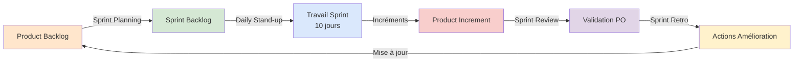

# PARTIE 4 : ORGANISATION DES RITUELS AGILE
## Projet Education Data Hub - Cadre Méthodologique

---

## 4.1 PRÉSENTATION DU CADRE AGILE SCRUM

### 4.1.1 Principes Fondamentaux Appliqués au Projet

Le projet Education Data Hub adopte le **framework Scrum** pour sa capacité à :
- **Livrer de la valeur incrémentalement** : MVP fonctionnel à chaque sprint
- **S'adapter aux changements** : Product Backlog dynamique, feedback continu
- **Maximiser la transparence** : Rituels réguliers, indicateurs visibles (Kanban, Burndown)
- **Favoriser l'amélioration continue** : Rétrospectives à chaque sprint

### 4.1.2 Cycle Scrum du Projet (2 semaines)



**Durée sprint** : **2 semaines (10 jours ouvrés)**

**Justification** :
- ✅ Suffisamment long pour livrer de la valeur (3-5 US/sprint)
- ✅ Suffisamment court pour adaptation rapide
- ✅ Compatible avec le délai global (6 semaines = 3 sprints)

---

## 4.2 SPRINT PLANNING - PLANIFICATION DU SPRINT

### 4.2.1 Objectifs et Principes

**But** : Définir collectivement le travail du sprint à venir

**Principes clés** :
- **Collaboration** : Product Owner + Data Engineer + Testeur
- **Transparence** : Product Backlog partagé et priorisé
- **Engagement** : L'équipe s'engage sur un Sprint Goal réaliste

### 4.2.2 Déroulement du Sprint Planning (2 heures)

#### **Phase 1 : QUOI ? Sélection des User Stories (60 min)**

**Responsable** : Product Owner

**Activités** :
1. **Présentation du contexte** (10 min)
   - Rappel vision produit
   - Évolution depuis dernier sprint
   - Priorités métier

2. **Review du Product Backlog** (20 min)
   - Lecture des US prioritaires
   - Clarification critères d'acceptation
   - Questions de l'équipe

3. **Estimation collective - Planning Poker** (30 min)
   - Estimation US par US (suite Fibonacci)
   - Discussion écarts (>2 SP)
   - Consensus atteint par vote

**Exemple Sprint Planning 1 (08/01/2024)** :

| Timing | Activité | Détails |
|--------|----------|---------|
| 9h00-9h10 | Présentation contexte | Vision : "Centraliser données éducatives pour faciliter analyse" |
| 9h10-9h30 | Review US1-US5 | US1 (Infra Azure), US2 (Import data.gouv), US3 (INSEE), US4 (OpenDataSoft), US5 (Tests) |
| 9h30-10h00 | Planning Poker | US1=5 SP, US2=3 SP, US3=2 SP, US4=3 SP, US5=3 SP → **Total 16 SP** |

---

#### **Phase 2 : COMMENT ? Décomposition en Tâches (60 min)**

**Responsable** : Data Engineer (Scrum Master)

**Activités** :
1. **Définition du Sprint Goal** (10 min)
   > *"Mettre en place l'infrastructure Azure et automatiser l'import de toutes les sources de données"*

2. **Décomposition technique des US** (40 min)
   - Chaque US décomposée en tâches atomiques (<1 jour)
   - Assignation des tâches
   - Identification dépendances

3. **Validation du Sprint Backlog** (10 min)
   - Vérification charge (16 SP < capacité 18 SP)
   - Engagement de l'équipe
   - Création Issues GitHub

**Exemple Décomposition US1 (Infrastructure Azure)** :

```
US1 : Configuration infrastructure Azure [5 SP]
├── Tâche 1.1 : Setup Terraform files (main.tf, variables.tf) [0.5j]
├── Tâche 1.2 : Provision Resource Group + Storage Account [0.5j]
├── Tâche 1.3 : Configure containers (raw, cleaned, tables) [0.5j]
├── Tâche 1.4 : Provision SQL Server + Database [0.5j]
├── Tâche 1.5 : Configure Terraform backend (state distant) [0.3j]
├── Tâche 1.6 : Test terraform plan & apply [0.2j]
└── Tâche 1.7 : Document infrastructure (README) [0.2j]
Total : 2.7j ≈ 2.5j
```

### 4.2.3 Livrables du Sprint Planning

✅ **Sprint Goal formalisé** (1 phrase)
✅ **Sprint Backlog complet** (US + tâches + estimations)
✅ **Issues GitHub créées** et assignées
✅ **Kanban board mis à jour** (US en colonne "TO DO")
✅ **Engagement de l'équipe** documenté (compte-rendu réunion)

### 4.2.4 Template Compte-Rendu Sprint Planning

```markdown
# Sprint Planning 1 - 08/01/2024

## Participants
- Product Owner : [Nom Encadrant]
- Scrum Master / Data Engineer : [Votre Nom]
- Testeur : [Nom Peer Reviewer]

## Sprint Goal
> "Mettre en place l'infrastructure Azure et automatiser l'import de toutes 
> les sources de données dans le Data Lake"

## User Stories Sélectionnées
| ID | Titre | Story Points | Responsable |
|----|-------|--------------|-------------|
| US1 | Configuration infrastructure Azure | 5 | Data Engineer |
| US2 | Scripts d'import data.gouv.fr | 3 | Data Engineer |
| US3 | Scripts d'import INSEE | 2 | Data Engineer |
| US4 | Scripts d'import OpenDataSoft | 3 | Data Engineer |
| US5 | Tests unitaires des imports | 3 | Data Engineer |
| **Total** | | **16 SP** | |

## Capacité Sprint
- Capacité théorique : 70h (7h/j × 10j)
- Déduction rituels : -10h
- **Capacité nette : 60h**
- Vélocité cible : 15-18 SP
- **Charge sprint : 16 SP ✅ (dans capacité)**

## Décomposition Technique
[Détails tâches US1-US5 - voir GitHub Project]

## Risques Identifiés
- Complexité Terraform (première fois) → Mitigation : Documentation officielle
- Formats CSV hétérogènes → Mitigation : Tests sur échantillons

## Prochaine Réunion
- Daily Stand-up : Messages quotidiens (asynchrone)
- Sprint Review 1 : 19/01/2024 à 14h
```

---

## 4.3 DAILY STAND-UP - SYNCHRONISATION QUOTIDIENNE

### 4.3.1 Adaptation au Contexte Solo

**Contrainte** : Équipe réduite (1 Data Engineer temps plein)

**Solution adoptée** : **Daily Stand-up asynchrone via commits GitHub**

**Principe** : Remplacer la réunion quotidienne par des commits structurés traçant l'avancement.

### 4.3.2 Format du Daily Stand-up Asynchrone

#### **Template Commit Message Daily**

```
[Daily] JJ/MM - <Tâche US en cours>

✅ Hier : <ce qui a été accompli>
🔄 Aujourd'hui : <ce qui sera fait>
🚧 Blocages : <aucun OU description>
📊 Avancement : <X/Y tâches complétées>
```

#### **Exemple Réel - Daily du 10/01/2024**

```
[Daily] 10/01 - US2 Import data.gouv

✅ Hier : 
- Développé module azure_upload.py (upload_json_to_azure, upload_from_url)
- Tests unitaires azure_upload.py (couverture 90%)

🔄 Aujourd'hui : 
- Implémenter import_data_gouv.py (4 datasets)
- Créer workflow GitHub Actions pour import mensuel
- Tests unitaires import_data_gouv.py

🚧 Blocages : Aucun

📊 Avancement : US2 - 2/5 tâches complétées (40%)
```

### 4.3.3 Règles de Gestion du Daily

**Fréquence** : **Quotidienne** (du lundi au vendredi)

**Timing** : Commit effectué **en fin de journée** (17h-18h)

**Visibilité** :
- Commits visibles dans l'historique Git
- Issues GitHub mises à jour (progression %)
- Kanban board actualisé (déplacement colonnes)

**Escalade des blocages** :
- Blocage technique : Recherche documentation officielle
- Blocage Azure : Support Azure (tickets)
- Blocage fonctionnel : Email Product Owner (<24h réponse)

### 4.3.4 Bénéfices du Daily Asynchrone

✅ **Traçabilité** : Historique Git = journal de bord du projet
✅ **Transparence** : Product Owner peut consulter avancement à tout moment
✅ **Gain de temps** : Pas de réunion quotidienne (15 min × 30 jours = 7.5h économisées)
✅ **Discipline** : Force à formaliser quotidiennement l'avancement
✅ **Documentation** : Commits daily = base rétrospectives

### 4.3.5 Alternative : Daily Stand-up Synchrone (si équipe élargie)

**Si le projet évolue vers une équipe de 3+ personnes** :

**Format** : Réunion visio quotidienne de **15 minutes maximum**

**Ordre du jour** :
- Chaque membre répond aux 3 questions (5 min/personne)
  1. Qu'ai-je fait hier ?
  2. Que vais-je faire aujourd'hui ?
  3. Ai-je des blocages ?

**Règles strictes** :
- ⏰ Timing strict : 15 min chrono
- 🚫 Pas de débat technique (pris offline après)
- 🎯 Focus : Avancement, blocages, synchronisation

---

## 4.4 SPRINT REVIEW - REVUE DE SPRINT

### 4.4.1 Objectifs et Principes

**But** : Démontrer le travail accompli et recueillir du feedback

**Principes clés** :
- **Démonstration fonctionnelle** : "Show, don't tell"
- **Feedback actionnable** : Retours intégrés au Product Backlog
- **Transparence** : Montrer aussi ce qui n'a pas fonctionné

### 4.4.2 Déroulement de la Sprint Review (1 heure)

#### **Phase 1 : Introduction (5 min)**

**Responsable** : Scrum Master (Data Engineer)

**Contenu** :
- Rappel du Sprint Goal
- Métriques du sprint (vélocité, burndown)
- Vue d'ensemble des livrables

**Exemple Sprint Review 1** :
```
Sprint Goal : "Mettre en place l'infrastructure Azure et automatiser 
l'import de toutes les sources de données"

Métriques :
- Story Points complétés : 16/16 (100%)
- Vélocité : 16 SP
- Burndown : 0 SP restants
- Couverture tests : 85%
```

---

#### **Phase 2 : Démonstration des Fonctionnalités (40 min)**

**Responsable** : Data Engineer

**Format** : **Live demo** (pas de slides, que du code/résultat)

**Démonstration Sprint 1 - Exemple Détaillé** :

| Timing | US | Démonstration | Support |
|--------|----|--------------|-|--------|
| 5 min | US1 | **Infrastructure Azure**<br>- Portail Azure : Resource Group "RG-OKOTWICA-Prod"<br>- Storage Account avec 3 containers (raw, cleaned, tables)<br>- SQL Server + Database "EducationData"<br>- Terraform code (fichiers .tf) | Écran partagé Azure Portal |
| 8 min | US2 | **Import data.gouv.fr**<br>- Exécution workflow GitHub Actions manuellement<br>- Logs d'import (4 fichiers téléchargés)<br>- Azure Storage Explorer : fichiers dans `raw/data_gouv/`<br>- Vérification contenu CSV (aperçu lignes) | GitHub Actions + Storage Explorer |
| 5 min | US3 | **Import INSEE**<br>- Workflow GitHub Actions<br>- Fichier `financement.xlsx` dans `raw/insee/` | GitHub Actions + Storage Explorer |
| 7 min | US4 | **Import OpenDataSoft**<br>- Workflow GitHub Actions<br>- Fichier JSON combiné (9 requêtes agrégées)<br>- Contenu JSON (nombre lycées récupérés) | GitHub Actions + VS Code |
| 10 min | US5 | **Tests unitaires**<br>- Exécution `pytest` en local<br>- Rapport de couverture (85%)<br>- Workflow CI GitHub (tests automatisés) | Terminal + GitHub Actions |
| 5 min | - | **Démo bonus**<br>- Cron jobs configurés (1er du mois)<br>- Logs historiques imports | GitHub Actions |

**Bonnes pratiques démo** :
- ✅ Environnement préparé (pas de surprises)
- ✅ Données réelles (pas de mocks)
- ✅ Scénarios utilisateur (pas de code brut)
- ✅ Points de vigilance expliqués (ex: gestion UTF-8)

---

#### **Phase 3 : Feedback et Discussion (10 min)**

**Responsable** : Product Owner + Stakeholders

**Questions posées** :
- Les critères d'acceptation sont-ils remplis ?
- Les fonctionnalités correspondent-elles au besoin ?
- Des ajustements sont-ils nécessaires ?
- De nouvelles priorités émergent-elles ?

**Exemple Feedback Sprint 1** :

| Feedback | Type | Action |
|----------|------|--------|
| "Parfait, les imports fonctionnent. Pouvez-vous ajouter un endpoint pour les effectifs ?" | Demande nouvelle US | Ajout US16 au Product Backlog (priorité basse) |
| "La documentation Terraform est claire, bien joué !" | Félicitations | - |
| "Avez-vous testé avec des fichiers corrompus ?" | Question technique | Ajout tests robustesse (Sprint 2) |

---

#### **Phase 4 : Mise à Jour Product Backlog (5 min)**

**Responsable** : Product Owner

**Activités** :
- Ajout nouvelles US identifiées
- Re-priorisation si nécessaire
- Mise à jour estimations (si besoin)

**Exemple Sprint 1** :
- ✅ US16 ajoutée : "Endpoint API pour effectifs écoles" [3 SP] - Priorité Basse (V2)
- ✅ US5 complétée : Tests robustesse ajoutés aux critères US10

### 4.4.3 Livrables de la Sprint Review

✅ **Incrément produit fonctionnel** (MVP enrichi)
✅ **Compte-rendu réunion** (feedback documenté)
✅ **Product Backlog mis à jour** (nouvelles US, repriorisation)
✅ **Validation PO** (signature acceptation livrables)

### 4.4.4 Template Compte-Rendu Sprint Review

```markdown
# Sprint Review 1 - 19/01/2024

## Participants
- Product Owner : [Nom]
- Scrum Master / Data Engineer : [Nom]
- Testeur : [Nom]
- Stakeholders : [Noms éventuels]

## Sprint Goal (rappel)
> "Mettre en place l'infrastructure Azure et automatiser l'import de 
> toutes les sources de données"

## User Stories Démontrées
| US | Titre | Statut | Validation PO |
|----|-------|--------|---------------|
| US1 | Infrastructure Azure | ✅ Done | ✅ Accepté |
| US2 | Import data.gouv | ✅ Done | ✅ Accepté |
| US3 | Import INSEE | ✅ Done | ✅ Accepté |
| US4 | Import OpenDataSoft | ✅ Done | ✅ Accepté |
| US5 | Tests unitaires | ✅ Done | ✅ Accepté |

## Métriques Sprint
- Story Points complétés : 16/16 (100%)
- Vélocité : 16 SP
- Couverture tests : 85%
- Bugs critiques : 0

## Feedback Recueillis
1. **Positif** : Infrastructure solide, imports automatisés fonctionnels
2. **Demande** : Ajouter endpoint pour effectifs écoles (→ US16 backlog)
3. **Question** : Tests avec fichiers corrompus ? (→ Ajout US10)

## Actions Suivantes
- ✅ US16 ajoutée au Product Backlog (priorité basse)
- ✅ Tests robustesse intégrés Sprint 2
- ✅ Sprint Planning 2 planifié : 22/01 à 9h
```

---

## 4.5 SPRINT RETROSPECTIVE - AMÉLIORATION CONTINUE

### 4.5.1 Objectifs et Principes

**But** : Identifier les améliorations pour le prochain sprint

**Principes clés** :
- **Bienveillance** : Critique constructive, pas de blâme
- **Actionnable** : Définir des actions concrètes
- **Suivi** : Vérifier les actions précédentes

### 4.5.2 Déroulement de la Sprint Retrospective (1 heure)

#### **Phase 1 : Définir le Contexte (5 min)**

**Responsable** : Scrum Master

**Activités** :
- Rappel objectif rétrospective
- Règle de bienveillance
- Review actions sprint précédent

---

#### **Phase 2 : Collecte des Données (20 min)**

**Méthode** : **Start / Stop / Continue**

**Support** : Tableau collaboratif (Miro, ou papier)

```
┌────────────────────┬────────────────────┬────────────────────┐
│   🟢 START         │   🔴 STOP          │   🔵 CONTINUE      │
│  (Commencer à)     │  (Arrêter de)      │  (Continuer à)     │
├────────────────────┼────────────────────┼────────────────────┤
│ • Documenter       │ • Sous-estimer     │ • Tests unitaires  │
│   décisions archi  │   temps config     │   systématiques    │
│   (ADR)            │   Azure            │                    │
│                    │                    │ • Workflows GitHub │
│ • Faire commits    │                    │   Actions bien     │
│   plus atomiques   │                    │   structurés       │
│                    │                    │                    │
│ • Tester sur       │                    │ • Communication    │
│   échantillons     │                    │   régulière avec PO│
│   avant déploiement│                    │                    │
└────────────────────┴────────────────────┴────────────────────┘
```

**Exemple Rétrospective Sprint 1** :

| Catégorie | Observation | Proposé par |
|-----------|-------------|-------------|
| 🟢 START | Documenter les choix techniques (ADR) | Data Engineer |
| 🟢 START | Commits plus atomiques (1 commit = 1 fonctionnalité) | Testeur |
| 🔴 STOP | Sous-estimer le temps de configuration Azure | Data Engineer |
| 🔵 CONTINUE | Tests unitaires systématiques (85% couverture) | Product Owner |
| 🔵 CONTINUE | Workflows GitHub Actions bien organisés | Testeur |

---

#### **Phase 3 : Génération d'Idées (20 min)**

**Méthode** : **5 Whys** (pour creuser les causes racines)

**Exemple - Problème : "Sous-estimation temps Azure"**

```
1. Pourquoi avons-nous sous-estimé ?
   → Première expérience Terraform

2. Pourquoi première expérience problématique ?
   → Manque de documentation préalable

3. Pourquoi manque de documentation ?
   → Pas de phase de recherche avant estimation

4. Pourquoi pas de phase de recherche ?
   → Planning Poker trop rapide

5. Pourquoi Planning Poker trop rapide ?
   → Pas de buffer "découverte" pour nouvelles technos
```

**Action identifiée** :
> "Ajouter +30% buffer sur toutes estimations impliquant nouvelles technologies"

---

#### **Phase 4 : Décision des Actions (10 min)**

**Méthode** : Vote par points (chaque participant = 3 votes)

**Actions Sprint 1** :

| Action | Votes | Priorité | Responsable | Échéance |
|--------|-------|----------|-------------|----------|
| Créer template ADR (Architecture Decision Record) | ⭐⭐⭐ | Haute | Data Engineer | Sprint 2 (avant US6) |
| Ajouter buffer 30% estimations Azure | ⭐⭐ | Moyenne | Scrum Master | Sprint Planning 2 |
| Commits atomiques (1 commit = 1 fonctionnalité) | ⭐ | Basse | Data Engineer | Immédiat |

**Engagement** : Les 2 actions prioritaires seront implémentées dans Sprint 2.

---

#### **Phase 5 : Clôture (5 min)**

**Activités** :
- Validation actions par le Product Owner
- Ajout actions au Sprint Backlog suivant (si temps requis)
- Remerciements et célébration des réussites

**Exemple** :
> "Félicitations pour les 16 SP complétés ! L'infrastructure est solide. 
> Concentrons-nous sur la documentation technique Sprint 2. 🎉"

### 4.5.3 Livrables de la Sprint Retrospective

✅ **Liste actions d'amélioration** (priorisées, assignées, datées)
✅ **Compte-rendu rétrospective** (Start/Stop/Continue documenté)
✅ **Suivi actions précédentes** (implémentées ou reportées)
✅ **Mise à jour Definition of Done** (si évolution des critères)

### 4.5.4 Template Compte-Rendu Sprint Retrospective

```markdown
# Sprint Retrospective 1 - 19/01/2024

## Participants
- Scrum Master / Data Engineer : [Nom]
- Product Owner : [Nom]
- Testeur : [Nom]

## Actions Sprint Précédent (N/A - premier sprint)
N/A

## 🟢 START (Commencer à)
1. **Documenter choix techniques (ADR)**
   - Contexte : Décisions d'architecture perdues
   - Action : Créer template ADR + documenter choix Terraform
   - Responsable : Data Engineer
   - Échéance : Avant US6 (Sprint 2)

2. **Commits plus atomiques**
   - Contexte : Commits trop gros, difficiles à review
   - Action : 1 commit = 1 fonctionnalité
   - Responsable : Data Engineer
   - Échéance : Immédiat

## 🔴 STOP (Arrêter de)
1. **Sous-estimer temps configuration Azure**
   - Contexte : US1 estimée 5 SP, réelle 5.5 SP
   - Action : Buffer +30% sur nouvelles technos
   - Responsable : Scrum Master
   - Échéance : Sprint Planning 2

## 🔵 CONTINUE (Continuer à)
1. **Tests unitaires systématiques** (85% couverture) ✅
2. **Workflows GitHub Actions bien structurés** ✅
3. **Communication régulière Product Owner** ✅

## Actions Priorisées (vote)
| Action | Votes | Priorité | Status Sprint 2 |
|--------|-------|----------|----------------|
| Template ADR | ⭐⭐⭐ | Haute | ✅ Implémenté |
| Buffer 30% Azure | ⭐⭐ | Moyenne | ✅ Implémenté |
| Commits atomiques | ⭐ | Basse | ✅ Implémenté |

## Célébrations 🎉
- Infrastructure Azure 100% fonctionnelle
- Aucun bug critique
- Vélocité 16 SP (excellent démarrage)

## Prochaine Rétrospective
Sprint Retrospective 2 : 02/02/2024 à 15h
```

---

## 4.6 DEFINITION OF DONE (DoD) - CRITÈRES DE QUALITÉ

### 4.6.1 Rôle et Importance

**Définition** : Liste de critères qu'une User Story doit remplir pour être considérée "Done".

**Objectifs** :
- **Transparence** : Tous partagent la même définition de "terminé"
- **Qualité** : Garantir un niveau de qualité minimum
- **Engagement** : Pas de "presque fini", c'est "Done" ou "Not Done"

### 4.6.2 Definition of Done du Projet Education Data Hub

#### **Critères Obligatoires (100% requis)**

```markdown
## ✅ Definition of Done - Education Data Hub

Une User Story est "Done" SI ET SEULEMENT SI :

### 1. Code
- [ ] Code développé et fonctionnel
- [ ] Code versionné sur GitHub (branche feature merged dans main)
- [ ] Commits avec messages explicites (format : `type(scope): message`)
- [ ] Pas de code commenté inutile
- [ ] Respect conventions Python (PEP 8)

### 2. Tests
- [ ] Tests unitaires écrits (pytest)
- [ ] Couverture de tests > 80% pour le module
- [ ] Tests d'intégration si applicable
- [ ] Tous les tests passent (CI/CD vert)
- [ ] Pas de tests commentés ou skipés sans justification

### 3. Documentation
- [ ] Docstrings Python pour les fonctions principales
- [ ] README mis à jour si changement d'architecture
- [ ] Diagrammes à jour si applicable
- [ ] Exemples d'utilisation fournis (si API/module réutilisable)

### 4. CI/CD
- [ ] Pipeline CI/CD passe (tests + linting)
- [ ] Aucune régression détectée
- [ ] Build Docker réussi (si US11+)
- [ ] Déploiement automatique réussi (si US14+)

### 5. Revue
- [ ] Code review effectuée (Pull Request GitHub)
- [ ] Feedback du revieweur intégré
- [ ] Pull Request approuvée et mergée
- [ ] Pas de "TODO" bloquants dans le code

### 6. Acceptance
- [ ] Tous les critères d'acceptation de l'US validés
- [ ] Démonstration fonctionnelle réalisée (Sprint Review)
- [ ] Product Owner a accepté le livrable (validation formelle)
- [ ] Issue GitHub fermée avec label "done"

## ⚠️ Si UN SEUL critère manque → US = "Not Done"
```

### 4.6.3 Évolution de la DoD au Fil du Projet

La DoD peut être enrichie lors des rétrospectives :

| Sprint | Critère Ajouté | Justification |
|--------|----------------|---------------|
| Sprint 1 | - | DoD initiale validée |
| Sprint 2 | "ADR documentée pour choix techniques majeurs" | Feedback rétrospective 1 |
| Sprint 3 | "Tests de sécurité API (OWASP Top 10)" | Ajout authentification JWT |

---

## 4.7 SUIVI DES RITUELS AGILE

### 4.7.1 Calendrier des Rituels (6 semaines)

```mermaid
gantt
    title Calendrier Rituels Agile - Education Data Hub
    dateFormat YYYY-MM-DD
    
    section Sprint 1
    Sprint Planning 1      :milestone, m1, 2024-01-08, 0d
    Daily Stand-ups (10j)  :2024-01-08, 10d
    Sprint Review 1        :milestone, m2, 2024-01-19, 0d
    Sprint Retro 1         :crit, 2024-01-19, 2h
    
    section Sprint 2
    Sprint Planning 2      :milestone, m3, 2024-01-22, 0d
    Daily Stand-ups (10j)  :2024-01-22, 10d
    Sprint Review 2        :milestone, m4, 2024-02-02, 0d
    Sprint Retro 2         :crit, 2024-02-02, 2h
    
    section Sprint 3
    Sprint Planning 3      :milestone, m5, 2024-02-05, 0