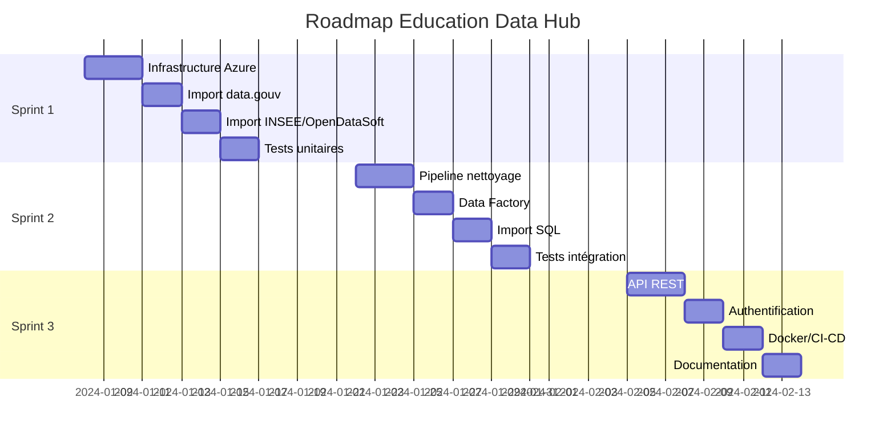

# Plan de Rapport E3 - Lancement d'un Projet Data

Voici un plan structuré pour votre rapport E3 basé sur le projet Education Data Hub et la méthode Agile :

---

## 📋 PLAN DU RAPPORT E3

### **Partie 1 : Contexte et Avant-Projet (3-4 pages)**

#### 1.1 Présentation du Projet Education Data Hub
- **Contexte stratégique** : Centralisation des données éducatives françaises pour l'analyse et la prise de décision
- **Objectifs SMART** :
  - Spécifique : Créer un hub centralisé de données éducatives
  - Mesurable : Intégrer 5 sources de données (INSEE, data.gouv, OpenDataSoft)
  - Acceptable : Répondre aux besoins d'analyse du secteur éducatif
  - Réaliste : Infrastructure Azure existante, compétences techniques disponibles
  - Temporellement défini : Déploiement en 3 sprints de 2 semaines

#### 1.2 Périmètre Fonctionnel
- **Collecte automatisée** de données depuis multiples sources
- **Stockage** dans un Data Lake Azure (architecture medallion : raw/cleaned/tables)
- **Transformation** ETL via Azure Data Factory
- **API REST** pour mise à disposition des données
- **Base de données SQL** pour l'analyse

#### 1.3 Analyse de Faisabilité (Matrice RICE)
- **Reach** : Établissements scolaires, chercheurs, décideurs publics
- **Impact** : Fort - amélioration de la prise de décision
- **Confidence** : Élevée - technologies éprouvées
- **Effort** : Moyen - 6 semaines avec 1 data engineer

---

### **Partie 2 : Feuille de Route Agile (2-3 pages)**

#### 2.1 Product Backlog Priorisé

**Sprint 1 - Infrastructure & Import (Semaines 1-2)**
- US1 : Configuration infrastructure Azure (Terraform)
- US2 : Scripts d'import data.gouv.fr
- US3 : Scripts d'import INSEE
- US4 : Scripts d'import OpenDataSoft
- US5 : Tests unitaires des imports

**Sprint 2 - Pipeline & Transformation (Semaines 3-4)**
- US6 : Pipeline de nettoyage CSV
- US7 : Data Factory - conversion Parquet
- US8 : Import SQL automatisé
- US9 : Documentation technique
- US10 : Tests d'intégration

**Sprint 3 - API & Déploiement (Semaines 5-6)**
- US11 : API FastAPI avec endpoints
- US12 : Système d'authentification JWT
- US13 : Dockerisation de l'API
- US14 : CI/CD GitHub Actions
- US15 : Documentation utilisateur

#### 2.2 Roadmap Visuelle


---

### **Partie 3 : Planification et Estimation (2-3 pages)**

#### 3.1 Composition de l'Équipe
- **Data Engineer** (vous) : Développement complet
- **Product Owner** : Validation des besoins (encadrant)
- **Testeur** : Validation qualité (peer review GitHub)

#### 3.2 Calendrier Détaillé avec Planning Poker

| User Story | Description | Story Points | Jours | Responsable |
|------------|-------------|--------------|-------|-------------|
| US1 | Infrastructure Terraform | 5 | 2.5j | Data Engineer |
| US2 | Import data.gouv | 3 | 1.5j | Data Engineer |
| US3 | Import INSEE | 2 | 1j | Data Engineer |
| US4 | Import OpenDataSoft | 3 | 1.5j | Data Engineer |
| US5 | Tests unitaires imports | 3 | 1.5j | Data Engineer |
| US6 | Pipeline nettoyage | 5 | 2.5j | Data Engineer |
| US7 | Azure Data Factory | 5 | 2.5j | Data Engineer |
| US8 | Import SQL | 3 | 1.5j | Data Engineer |
| US9 | Documentation technique | 2 | 1j | Data Engineer |
| US10 | Tests intégration | 3 | 1.5j | Data Engineer |
| US11 | API FastAPI | 5 | 2.5j | Data Engineer |
| US12 | Authentification JWT | 3 | 1.5j | Data Engineer |
| US13 | Docker | 2 | 1j | Data Engineer |
| US14 | CI/CD | 5 | 2.5j | Data Engineer |
| US15 | Documentation utilisateur | 2 | 1j | Data Engineer |

**Total : 51 Story Points ≈ 25.5 jours** (ajusté à 30 jours avec buffer)

#### 3.3 Outils de Suivi Agile
- **GitHub Projects** : Kanban board (To Do, In Progress, Review, Done)
- **GitHub Actions** : CI/CD automatisé
- **GitHub Issues** : Tracking des US et bugs
- **GitHub Wiki** : Documentation centralisée

---

### **Partie 4 : Organisation des Rituels Agile (1-2 pages)**

#### 4.1 Rituels du Sprint

**Sprint Planning (2h - début de sprint)**
- Sélection des US du Product Backlog
- Décomposition en tâches techniques
- Estimation collective (Planning Poker)
- Définition du Sprint Goal

**Daily Stand-up (15min quotidien)**
- Format : Hier / Aujourd'hui / Blocages
- Via commit messages structurés dans GitHub

**Sprint Review (1h - fin de sprint)**
- Démo des fonctionnalités développées
- Feedback du Product Owner
- Mise à jour du Product Backlog

**Sprint Retrospective (1h - fin de sprint)**
- Ce qui a bien fonctionné
- Points d'amélioration
- Actions correctives pour le prochain sprint

#### 4.2 Definition of Done (DoD)
- ✅ Code développé et versionné sur GitHub
- ✅ Tests unitaires > 80% de couverture
- ✅ Documentation technique à jour
- ✅ Pipeline CI/CD passant (green)
- ✅ Revue de code effectuée (pull request)
- ✅ Déployé en environnement de test

---

### **Partie 5 : Stratégie de Communication (2 pages)**

#### 5.1 Communication Interne (Équipe Projet)

**Canaux de Communication**
- **GitHub** : Communication asynchrone via Issues/PRs/Comments
- **README.md** : Point d'entrée documentation
- **CHANGELOG.md** : Historique des modifications
- **GitHub Wiki** : Documentation technique détaillée

**Planning des Communications**
| Événement | Fréquence | Format | Participants |
|-----------|-----------|--------|--------------|
| Sprint Planning | Début sprint | Réunion | Équipe + PO |
| Daily Stand-up | Quotidien | Asynchrone | Équipe |
| Sprint Review | Fin sprint | Démo | Équipe + PO + Stakeholders |
| Sprint Retro | Fin sprint | Réunion | Équipe |

#### 5.2 Communication Externe (Stakeholders)

**Bulletin d'Information Sprint** (envoi fin de sprint)
- ✅ Objectifs atteints
- 📊 Métriques clés (vélocité, burndown chart)
- 🚧 Difficultés rencontrées et solutions
- 📅 Prochaines étapes

**Exemple de bulletin Sprint 1 :**
```
📧 Bulletin Sprint 1 - Education Data Hub
✅ 13 Story Points complétés sur 15 prévus
✅ Infrastructure Azure opérationnelle (Terraform)
✅ 3 sources de données intégrées (data.gouv, INSEE, OpenDataSoft)
✅ 12 tests unitaires créés (couverture 85%)
🚧 Difficulté : Conversion UTF-8-SIG → Résolu avec preprocessing
📅 Sprint 2 : Focus sur le pipeline ETL et Data Factory
```

#### 5.3 Documentation Utilisateur
- **API Documentation** : OpenAPI/Swagger intégré
- **README complets** : Instructions d'installation et d'utilisation
- **Workflows CI/CD** : Documentation des processus automatisés
- **Architecture Diagrams** : Mermaid pour la visualisation

---

### **Partie 6 : Conformité RGPD et Accessibilité (1-2 pages)**

#### 6.1 Mesures RGPD Appliquées
- **Registre des traitements** : Documentation des données personnelles manipulées
- **Procédures de tri** : Scripts de suppression automatique (retention policies)
- **Sécurisation** : Azure Key Vault pour secrets, authentification JWT
- **Minimisation** : Collecte uniquement des données nécessaires

#### 6.2 Accessibilité du Projet
- **Code** : Commentaires en français, noms de variables explicites
- **Documentation** : Markdown accessible, alternatives textuelles pour diagrammes
- **API** : Endpoints RESTful standard, messages d'erreur clairs

---

### **Partie 7 : Support de Présentation (Annexe)**

#### 7.1 Diapositives pour le Jeu de Rôle (10-12 slides)

**Slide 1 : Titre**
- Lancement du projet Education Data Hub
- Date, logo, participants

**Slide 2 : Contexte et Enjeux**
- Problématique : Données éducatives dispersées
- Opportunité : Centralisation pour analyse

**Slide 3 : Avant-Projet**
- Objectifs SMART
- Périmètre fonctionnel
- Faisabilité (RICE)

**Slide 4 : Architecture Technique**
- Diagramme d'infrastructure Azure
- Flux de données (raw → cleaned → tables → API)

**Slide 5 : Feuille de Route (Roadmap)**
- Timeline des 3 sprints
- Jalons principaux

**Slide 6 : Organisation Agile**
- Composition de l'équipe
- Rituels du sprint

**Slide 7 : Sprint 1 - Objectifs**
- US priorisées
- Burndown chart prévisionnel

**Slide 8 : Outils de Suivi**
- GitHub Projects (capture Kanban)
- CI/CD GitHub Actions

**Slide 9 : Stratégie de Communication**
- Canaux internes/externes
- Fréquence des points

**Slide 10 : RGPD & Accessibilité**
- Actions de conformité
- Standards respectés

**Slide 11 : Risques et Mitigation**
- Techniques, planning, budget
- Plans de contingence

**Slide 12 : Questions / Échanges**

---

### **Documents Associés (Annexes)**

1. **Avant-Projet Complet** (5-7 pages)
   - Note de synthèse
   - Étude d'opportunités
   - Benchmark solutions existantes
   - Analyse RICE détaillée

2. **Product Backlog Excel/CSV**
   - Liste complète des User Stories
   - Critères d'acceptation
   - Story Points

3. **Sprint Backlog (exemple Sprint 1)**
   - Décomposition en tâches
   - Assignations
   - Burndown chart

4. **Diagrammes d'Architecture**
   - Infrastructure Azure (Terraform)
   - Flux de données (Mermaid)
   - CI/CD pipeline

5. **Captures GitHub**
   - Projects Board
   - Pull Requests
   - Actions Workflows

---

## 📊 Livrables Attendus pour E3

✅ **Support de présentation** : 10-12 slides PowerPoint  
✅ **Documents projet** :
- Avant-projet (annexe complète)
- Feuille de route détaillée
- Calendrier de production (Gantt/Kanban)
- Stratégie de communication
- Rituels Agile documentés

✅ **Démonstration** : Simulation introduction réunion de lancement (10-15 min)

---

## 🎯 Conseils pour la Soutenance

1. **Introduction réunion (2 min)** : Contexte, enjeux, ordre du jour
2. **Présentation avant-projet (3 min)** : Objectifs, périmètre, faisabilité
3. **Feuille de route (2 min)** : Timeline, sprints, jalons
4. **Organisation Agile (2 min)** : Équipe, rituels, outils
5. **Communication (2 min)** : Canaux, fréquence, formats
6. **Échanges avec le jury (5 min)** : Questions/réponses

**Posture recommandée** : Chef de projet data enthousiaste et structuré, maîtrisant la méthodologie Agile et les enjeux techniques.

---

Ce plan couvre les **7 compétences visées** (C5, C6, C7) et respecte les **critères d'évaluation** du référentiel RNCP 37638. Votre projet GitHub Education Data Hub fournit des exemples concrets pour chaque section. 🚀